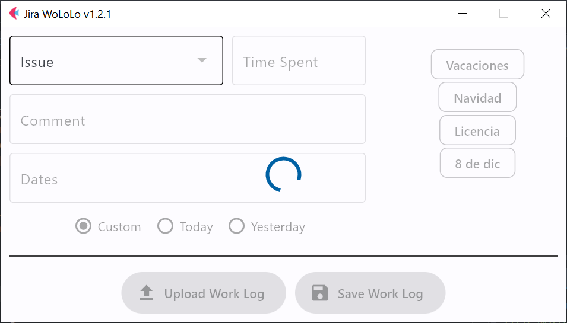

# Jira Work Log Logger
The Jira Work Log Logger (or WoLoLo, for those who recall playing AoE) is an app (still in development) to help everyone streamline daily time tracking tasks.

> [!NOTE]
> For now, the app will only allow you to upload work logs in issues you already have work logs. This is a safety measure.

## Installing the Required Packages

The Jira Wololo need some packages to work so make sure you have the required modules to run the app. It is supposed that you already have `python` and `pip` installed.

Open the command line on the script folder and run:

```
pip install --upgrade -r requirements.txt
```

## Setting Up the Environment

The first thing to do is to create a `.env` file in the same folder the `jira_wololo.py` script is located. This file is not provided since it contains sensitive information. Add the following code to it and complete the lines with your information.

```
SERVER = ''
EMAIL = ''
TOKEN = ''
```

## Creating an API Token for Atlassian Account

1. Go to Confluence and log in if you are not.
2. Go to Confluence and log in if you are not.

## Running the App

To execute the app, type:

	python jira_wololo.py

The app will show up and start downloading the issues you already have worklogs in.



Once done, you can start filling the work log information.

Note that the buttons will not enable until you enter all fields CORRECTLY:

- Issue: choose an issue.
- Time Spent: enter the time you want to log, the format is the same as in Jira.
- Comment: the comments are opcional.
- Dates: dates come in 4 flavors and must be written in a comma separated fashion:
  - individual: `2023.11.12` or `2023/11/12` (accordingly with ISO 8601: year/mount/day).
  - Interval: start:end (e.g. `2023.11.13:2023.11.20`).
  - Negative individual: just append a `-` if you want to remove specific days from the given dates (e.g. `-2023.11.13`).
  - Negative interval: same as before, append a `-` to an interval to remove it from the given days (e.g. `-2023.11.13:2023.11.20`).

To log work on November 1 and 5 you can write: `2023.11.1:2023.11.5,-2023.11.4,-2023.11.2:2023.11.3`.

For now, Saturdays and Sundays are automatically removed.

All logs “creation” time is set to 9 o’clock.

## Date Placeholders

The app will automatically replace the date placeholders with the current date value.

`{year}.12.25`